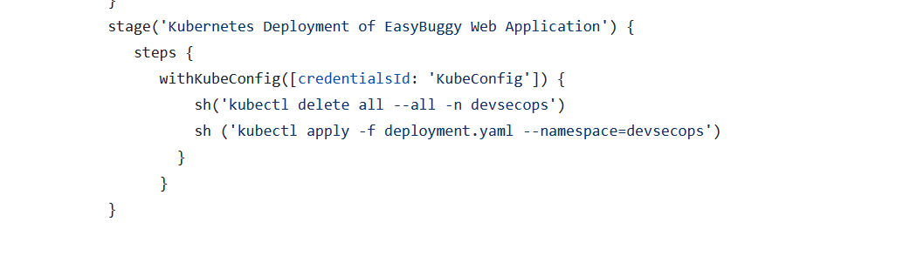

# Deployment to Kubernetes Cluster on AWS

#### 1. Create Kubernetes cluster on AWS 

Connect to the EC2 instance we created initially and run the command

        eksctl create cluster --name kubernetes-cluster --version 1.23 --region us-west-2 --nodegroup-name linux-nodes --node-type t2.xlarge --nodes 2

#### 2. Add Kubelogin to Jenkins

i. On EC2 instance execute
        
        cat  /home/ec2-user/.kube/config

Copy the contents and save in the project directory as file.

ii. Add credentials on Jenkins

Jenkins Dashboard -> Manage Jenkins -> credentials -> Stores -> scoped to Jenkins -> System -> Global credentials -> Add credentials

#### 3. Add Deployment stage in jenkins pipeline

#### 4. Create devsecops namespace using the command on EC2 Connect

        kubectl create namespace devsecops

#### 5. Create deployment file in the repo.

#### 6. Create Jenkins job and configure

#### 7. Run the job

#### 8. Validate on EC2 Connect

        kubectl get namespace
        kubectl get deployment -n devsecops
        kubectl get svc -n devsecops
        kubectl get pods -n devsecops

#### 9. Access the deployed app on browser

        NAME        TYPE           CLUSTER-IP      EXTERNAL-IP                                                               PORT(S)        AGE
        easybuggy   LoadBalancer   10.100.45.167   a931abf8b30814ab98906b7cf3051311-1499731652.us-west-2.elb.amazonaws.com   80:30470/TCP   109s

In the browser access http://a931abf8b30814ab98906b7cf3051311-1499731652.us-west-2.elb.amazonaws.com:80

